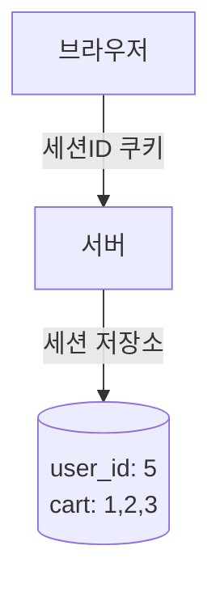
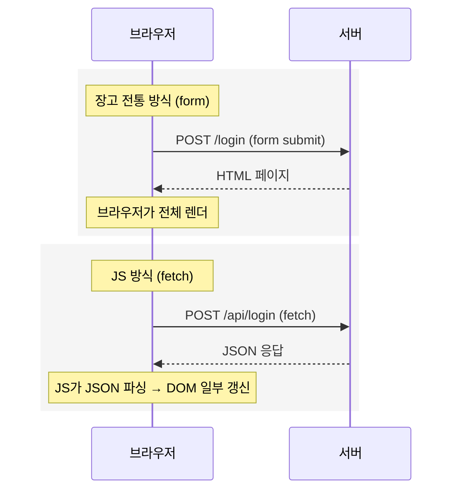
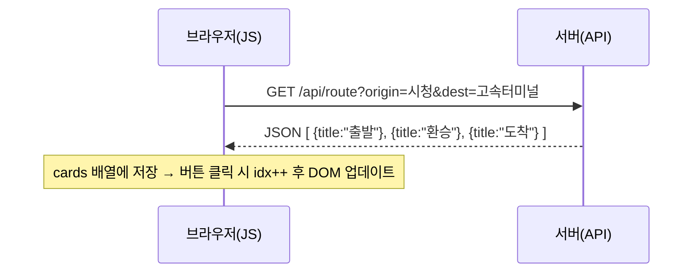
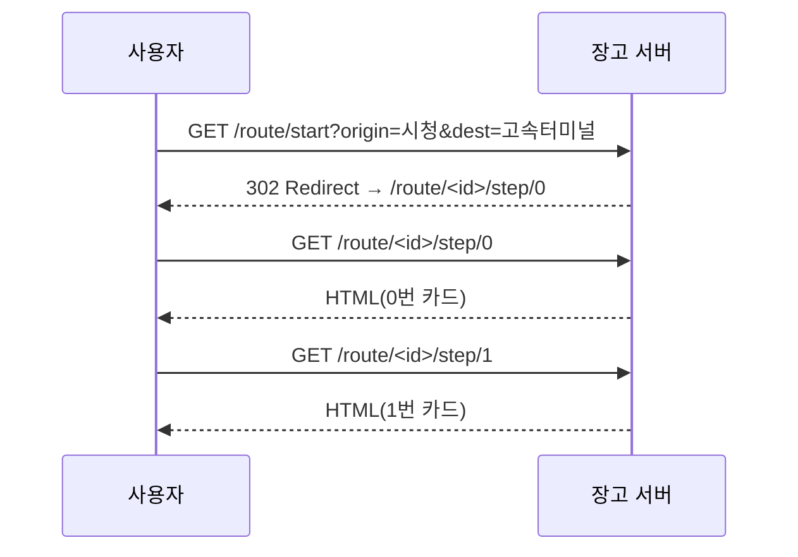

## 자바스크립트 (JavaScript)

브라우저(클라이언트) 안에서 **DOM(Document Object Model)을 조작**하는 언어

### DOM (Document Object Model)

- 브라우저가 HTML 문서를 객체 트리로 바꾼 것
- `<div id="result">` → JS에서 `document.querySelector('#result')`로 접근 가능
- DOM은 **화면의 살아있는 HTML 객체**
- JS는 `fetch`로 서버에 GET/POST 요청을 보낼 수 있음

**DOM 조작 예시**

- 필요한 경우: 채팅창 새 메시지만 추가, 좋아요 숫자만 변경
- 불필요한 경우: 글 작성 후 리스트 페이지로 이동, 로그인 후 마이페이지 이동

### 자바스크립트의 특징

- 새로고침 없이 화면 일부만 바꿀 수 있다.
- 모바일 앱/SPA와 같이 프론트-백 분리 구조에 필수
- 비동기 통신으로 UX 개선
- 하지만 장고 전통 방식은 **SEO/접근성/안정성** 면에서 강력하다.

### 세션 (session)

- 서버가 상태를 기억하는 방식
- HTTP는 기억력이 없음(stateless) → 사용자를 구분하기 위해 세션, 쿠키를 이용한다.
- 세션: 서버에 상태 저장, 브라우저엔 세션ID만 쿠키로 보관
    - 로그인, 장바구니, 경로 안내 등에 활용



## 자바스크립트와 장고의 HTTP 요청 방식

### JavaScript

- `fetch(url, options)` 로 **클라이언트(JS)가 주도**하여 HTTP 요청을 보낸다.
    - 응답(JSON/텍스트 등)을 **브라우저가 즉시 렌더하지 않음** → **JS가 받아서 DOM 일부만 갱신**한다.
- JS가 응답을 처리한다.(부분 DOM 갱신)

### **Django (전통 방식)**

- `<form method="GET/POST" action="/path/">` 같은 **HTML 폼 제출**로 **브라우저가 주도**하여 HTTP 요청을 보낸다.
- 서버가 반환한 **HTML 전체를 브라우저가 새로 렌더**한다(페이지 이동/새로고침).
- 브라우저가 응답을 처리한다.(전체 페이지 새 렌더)



### 자바스크립트 vs 장고

- 두 방법 모두 **HTTP 요청/응답**이다.

| 관점 | 자바스크립트 방식 | 장고 전통 방식 |
| --- | --- | --- |
| 상태 저장 | 브라우저 (메모리/Storage) | 서버 (세션/DB) |
| 화면 전환 | 무재로딩(DOM 갱신) | 페이지 이동(서버 렌더링) |
| 서버 역할 | JSON만 제공(API) | HTML 렌더링 제공 |
| 구현 난이도 | JS 로직 필요, UX 유연 | 단순·견고, SEO/URL 명확 |
| 네트워크 | 필요 시 fetch | 링크/폼/리다이렉트 |
- **JS 메모리/Storage** = 종이 쪽지에 경로 적어서 내가 들고 다님

    → 새로고침하면 쪽지 잃어버리거나, 다른 사람이 쪽지 훔칠 수 있음

- **서버 세션** = 식당 보관함에 맡기고 보관증(세션ID)만 들고 다님

    → 새로고침해도 서버가 기억하고 있고, 보안도 상대적으로 안전함


### JS 방식에서의 상태 관리

- JS 방식(SPA/AJAX)은 서버에서 **JSON만 응답**을 받음
- 상태(cards, 로그인 정보 등)를 **브라우저 메모리나 localStorage**에 들고 있음
- 페이지 이동 없이 **JS가 직접 DOM을 갱신**함



## 쉽길 프로젝트에 적용

- 우리가 원하는 건 **순차 카드 안내 + URL 명확 + 새로고침/재접속에도 상태 유지**임
- 따라서 **서버 세션 기반(장고 전통 방식)** 이 기본값으로 적합함

- 경로 안내 = 순차적 카드 이동
    - 각 스텝이 **독립된 URL**로 있어도 문제 없음
    - 따라서 **장고 전통 방식(서버 렌더링 + 세션 저장)**이 단순하고 안정적임



### Django (서버 사이드) 역할: 웹의 뼈대와 핵심 로직 구축

Django는 사용자의 요청에 따라 완전한 HTML 페이지를 처음 렌더링하거나, JavaScript가 요청하는 데이터를 JSON 형태로 제공하는 **API 서버**의 역할을 수행합니다. 새로고침해도 유지되어야 하는 핵심적인 데이터와 기능은 모두 Django가 담당합니다.

- **핵심 기능**
    - **경로 탐색 및 결과 페이지 생성**: 출발역, 도착역 정보를 받아 **최적 경로를 계산**하고, 그 결과를 담은 **초기 '경로 안내 스토리 카드' 페이지**를 생성합니다. 이 페이지는 고유 URL을 가지므로, 사용자가 링크를 저장하거나 공유할 수 있습니다.
    - **역 정보 조회 및 페이지 생성**: 특정 역의 편의시설, 출입구 공사 현황 등 **상세 정보를 보여주는 페이지**를 생성합니다.
    - **API 엔드포인트 제공**: JavaScript가 필요로 하는 데이터를 제공하는 창구 역할을 합니다.
        - `api/search?query=[역이름]` : 역 검색 자동완성을 위한 유사 역 이름 목록 반환
        - `api/station/[역ID]/status` : 특정 역의 실시간 시설(에스컬레이터 등) 정보 반환
        - `api/path/` : 음성 인식 등으로 파악된 출발/도착지를 POST로 받아 경로 탐색 결과(스토리 카드 데이터)를 JSON으로 반환
- **데이터 관리**
    - **지하철 데이터 관리**: 역, 노선, 환승 정보 등 정적인 데이터를 관리하고 서빙합니다.
    - **실시간 정보 처리**: 서울시 API 등 외부에서 가져온 **실시간 에스컬레이터 운행 정보**를 가공하여 경로 탐색에 반영합니다.

### JavaScript (클라이언트 사이드) 역할: 동적이고 인터랙티브한 사용자 경험

JavaScript는 이미 렌더링된 HTML 페이지 위에서, **새로고침 없이** 사용자와 상호작용하며 화면을 동적으로 변경하는 역할을 담당합니다.

- **사용자 인터랙션**
    - **역 검색 자동완성**: 사용자가 입력창에 글자를 입력할 때마다 Django API(`api/search`)에 요청을 보내 추천 역 목록을 받아와 보여줍니다.
    - **경로 안내 스토리 카드 네비게이션**: 사용자가 '다음', '이전' 버튼을 누를 때, 페이지 새로고침 없이 미리 받아온 스토리 카드 내용을 보여주거나 숨깁니다. (인스타그램 스토리처럼!)
    - **실시간 상태 업데이트**: 경로 안내 페이지에 머무는 동안, 주기적으로 Django API(`api/station/[역ID]/status`)를 호출하여 에스컬레이터 등 편의시설의 상태 변경을 감지하고, 화면에 "운행 중단" 등의 알림을 띄워줍니다.
- **UI/UX 개선**
    - **로딩 상태 표시**: Django에 데이터를 요청하고 기다리는 동안 로딩 스피너나 화면 전환 효과를 보여줍니다.
    - **경로 요약 및 기타 UI 요소**: 토스(toss) UI처럼 정보를 단계적으로 보여주는 모든 동적인 요소들을 제어합니다.

| 기능 | Django (Server) | JavaScript (Client) | 이유 |
| --- | --- | --- | --- |
| **최초 페이지 로드** | **O** |  | 사용자가 처음 접속했을 때의 화면 구성 |
| **경로 검색 결과** | **O** (페이지/데이터 생성) | **O** (결과 표시/카드 넘김) | 핵심 데이터는 서버에서, 동적 표현은 클라이언트에서 담당 |
| **역 검색 자동완성** | **O** (데이터 제공 API) | **O** (입력 감지 및 요청) | 실시간 상호작용이 중요하므로 클라이언트 주도 |
| **실시간 정보 반영** | **O** (정보 수집 및 API 제공) | **O** (주기적 확인 및 UI 업데이트) | 최신 정보 유지를 위해 클라이언트의 동적인 요청이 필요 |

**‘Django API를 호출한다’의 의미**

> **"우리가 Django로 만들어둔 특정 데이터 제공 창구(URL)에 JavaScript가 `fetch` 함수를 이용해 데이터**를 요청하고 받아온다"

- **Django URL 호출**: 브라우저가 Django에 **완제품(HTML 페이지)**을 요청하는 것. 화면 전체가 바뀝니다.
- **Django API 호출**: JavaScript가 Django에 **재료(데이터)**만 요청하는 것. 페이지 새로고침 없이, 필요한 부분만 동적으로 업데이트됩니다.


### API 명세서

프론트엔드와 백엔드가 따로 놀지 않고 완벽하게 협력하려면, 둘 사이의 **'약속'**이 필요합니다. 그것이 바로 **API 명세서**입니다.

기능 개발에 들어가기 전, 프론트엔드와 백엔드 개발자가 **반드시 함께 모여** API 명세서를 확정해야 합니다. **노션(Notion)에 페이지를 만들어 함께 작성**하는 것을 추천합니다.

- **무엇을 약속하는가?**
    - **요청(Request) 형식**: 프론트엔드가 어떤 주소(URL)로, 어떤 정보(파라미터)를 담아 요청할 것인가?
    - **응답(Response) 형식**: 요청을 받은 백엔드가 어떤 데이터(JSON)를, 어떤 구조로 돌려줄 것인가?
    - **에러 처리**: 실패했을 때는 어떻게 알려줄 것인가?

이 약속만 있다면, **두 팀은 서로를 기다릴 필요 없이 동시에 개발을 진행**할 수 있습니다.

- **프론트엔드**: 실제 API가 완성되기 전에도, 약속된 형식의 '가짜 데이터(Mock Data)'를 만들어 UI 개발을 먼저 끝낼 수 있습니다.
- **백엔드**: 프론트엔드 UI가 어떻게 생겼는지 신경 쓰지 않고, 약속된 데이터를 정확히 내려주는 로직 개발에만 집중할 수 있습니다.

**역 검색 자동완성 기능의 API 명세서 예시:**

- **요청**: `GET /api/search?query=[검색어]`
- **성공 응답**:

    ```json
    {
      "stations": [
        { "name": "강남역", "line": "2호선" },
        { "name": "강남구청역", "line": "7호선" }
      ]
    }
    ```

- **실패 응답**: `[]` (빈 배열)

**협업 방식:**

- **`[프론트/백엔드]` 병렬 개발**
    - **`프론트엔드`**: 백엔드를 기다리지 않고, 위 JSON 형식의 **가짜 데이터를 직접 만들어** 검색창 UI와 자동완성 목록 표시 기능을 완성합니다.
    - **`백엔드`**: 프론트 UI를 기다리지 않고, `query`를 받아 DB에서 역을 검색한 후 위 JSON 형식으로 데이터를 반환하는 **API 기능을 완성**합니다.
- **`[프론트]` 통합 및 테스트**
    - 프론트엔드 개발자가 가짜 데이터를 실제 백엔드 API 주소로 교체합니다.
    - 함께 테스트하며 약속대로 잘 동작하는지 확인하고, 문제가 있다면 명세서를 기준으로 수정합니다.