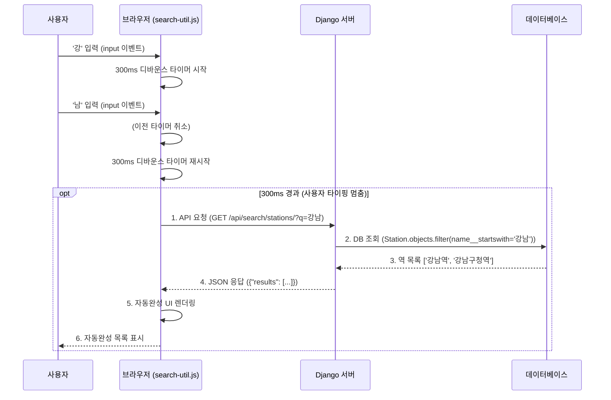

사용자가 출발역과 도착역을 입력할 때 가장 먼저 마주하는 기능인 '역 검색 자동완성'을 구현했다. 단순한 기능 같지만, 서버 부하를 줄이기 위한 최적화(Debouncing)부터 앱 간의 의존성 분리, 그리고 사용자 입력 경험(UX)까지 고민할 지점이 많았다.

---

## 어떻게 동작하는 거지?

사용자가 출발역이나 도착역을 입력할 때, 전체 역 이름을 다 치지 않아도 관련된 역 목록을 보여주는 자동완성 기능을 구현하였다. 이 기능은 사용자 경험(UX)을 개선하고 오타를 방지하는 데 목적이 있다.

전체적인 동작 과정은 다음과 같다:

1. **Client (JS):** 사용자가 텍스트(예: "강남")를 입력한다.
2. **Client (JS):** 300ms의 디바운싱(Debouncing) 대기 후, 서버 API로 비동기 요청을 보낸다.
3. **Server (Django):** 요청받은 키워드가 포함된 역을 DB에서 검색한다.
4. **Server (Django):** 검색 결과(예: ["강남역", "강남구청역"])를 JSON 형태로 반환한다.
5. **Client (JS):** 응답받은 데이터를 기반으로 UI에 자동완성 목록을 렌더링한다.



---

## Backend 구현 (Django)

### API 엔드포인트 위치 선정에 대한 고민

구현 초기, 역 검색 API를 어느 앱(App)에 위치시킬지에 대한 고민이 있었다. '길찾기' 과정에서 사용되므로 `journeys` 앱에 넣을 수도 있었으나, **'역 정보'를 제공하는 책임**은 `stations` 앱에 있다고 생각했다. 

- **`journeys` 앱:** 경로 탐색(A역 → B역)이 주 목적이다.
- **`stations` 앱:** 역 정보 자체를 관리한다.

"역 검색"은 경로를 찾기 위한 수단이지만, 데이터의 본질은 '역 정보'에 속한다. 따라서 `journeys` 앱이 역 정보까지 책임지게 되면 코드가 복잡해질 수 있어, **`stations` 앱이 검색 API를 제공하는 것이 구조적으로 옳다고 판단**했다.

### API 엔드포인트 및 검색 로직

`stations/views.py`에 검색 API를 구현하였다. 검색어 쿼리(`q`)를 받아 `Station` 모델에서 해당 문자열로 시작하는(`name__startswith`) 역을 찾아 JSON으로 반환한다.

```python
# stations/views.py
def search_stations(request):
    query = request.GET.get('q', None)
    results = []
    if query and len(query) > 0:
        # 'name_startswith': 해당 글자로 시작하는 역 검색
        stations = Stations.objects.filter(name_startswith=query)[:10] 
        for station in stations:
            results.append({
                'name': station.name,
                'line': station.line,
            })
    return JsonResponse({'results': results})
```

> Reflective Note (기술 부채): 현재 Station 모델이 journeys 앱에 정의되어 있어, stations 앱의 뷰가 다른 앱의 모델을 참조하는 의존성이 생겼습니다. 추후 리팩토링 시 모델을 stations 앱으로 옮기는 것을 고려하고 있습니다.
> 

---

## Frontend 구현 (JavaScript)

### 디바운싱 (Debouncing) 적용

사용자가 "강남"을 입력할 때, 'ㄱ', '가', '강', '강나', '강남'... 매 타이핑마다 API를 호출하면 서버에 불필요한 과부하가 걸린다. 이를 방지하기 위해 사용자의 입력이 0.3초(300ms) 동안 멈췄을 때 API를 한 번만 호출하도록 **디바운싱** 기술을 적용하였다.

```jsx
// static/js/search-util.js
function debounce(func, delay) {
    let debounceTimer;
    return function(...args) {
        clearTimeout(debounceTimer);
        debounceTimer = setTimeout(() => {
            func.apply(this, args);
        }, delay);
    }
};
```

### 비동기 데이터 처리 (Async/Await)

`search-util.js`라는 유틸리티 파일로 로직을 분리하여 `fetchStations` 함수를 통해 재사용성을 높였다. `async/await` 문법을 사용하여 비동기 코드를 직관적으로 작성했다.

### 코드 모듈화

유지보수성을 위해 자바스크립트 파일의 역할을 명확히 분리하였다 .

- `search-util.js`: `debounce`, `fetchStations` 등 범용적으로 사용되는 유틸리티 함수 정의
- `route.js`: 길찾기 페이지의 DOM 이벤트 및 UI 렌더링 담당
- `station_info.js`: 역 정보 페이지의 검색 로직 담당

---

## UX/UI 개선 및 트러블 슈팅

### 중복 역 이름 처리 (호선 정보)

'강남'을 검색했을 때 2호선 강남역과 신분당선 강남역이 중복되어 출력되는 문제가 있었다. 이를 해결하기 위해 자동완성 목록에는 **'역이름 (호선)'** 형태로 표시하여 사용자가 구분할 수 있게 하되, 실제 입력창에 들어가는 값은 **'역이름'**만 전달되도록 로직을 수정하였다 . 또한, UI상에서는 같은 역 이름에 대해 호선 정보를 한 줄에 출력하도록 DB 구조와 쿼리를 개선하였다 .

- **Before:**
    - 강남 (2호선)
    - 강남 (신분당선)
    
    *호선 정보가 여러 개인 역(강남)이 중복해서 출력되는 문제*
    
- **After:**
    - 강남 (2호선, 신분당선)
    
    *자동완성 기능 수정 후 테스트*

사용자에게는 호선 정보를 합쳐서 보여주되(`display value`), 내부적으로 값을 선택할 때는 역 이름(`value`)만 넘기도록 로직을 수정하여 가독성을 높였다.

### 입력 방식에 따른 유효성 검사 전략

사용자가 역을 입력하는 방식에는 두 가지 시나리오가 있다.

1. **자동완성 목록 클릭:** 이미 검증된 DB 데이터이므로 유효성 검사 불필요.
2. **직접 입력 후 엔터:** 오타 가능성이 있으므로 유효성 검사 필수.

회의를 통해 **"자동완성 목록에서 클릭하는 것이 기본 Flow이지만, 직접 입력 시에도 버튼 클릭과 동일한 기능을 수행해야 한다"**는 결론을 내리고 예외 처리를 추가했다.

### 레거시 코드 정리 (Mock Data 제거)

기존 `station_info.js` 파일이 DB 연동 후에도 여전히 삭제된 목업 데이터(`stations` 배열)를 참조하고 있어 검색 기능이 작동하지 않는 버그를 발견했다. 이를 해결하기 위해 파일 기반의 가짜 데이터를 제거하고, 앞서 구현한 API를 호출하여 DB 데이터를 가져오도록 수정이 필요함을 확인했다.


---

## 마치며 (Next Steps)

이번 자동완성 기능 구현을 통해 백엔드와 프론트엔드 간의 효율적인 데이터 통신 구조를 잡을 수 있었다. 향후에는 '이용 불가' 안내 기능을 단순 알림창에서 모달(Modal) 형태로 고도화하여 사용자 경험을 더욱 개선할 예정이다 . 또한, 기술 부채로 남아 있는 앱 간의 의존성 문제(Station 모델 위치)도 리팩토링 대상으로 고려하고 있다.
