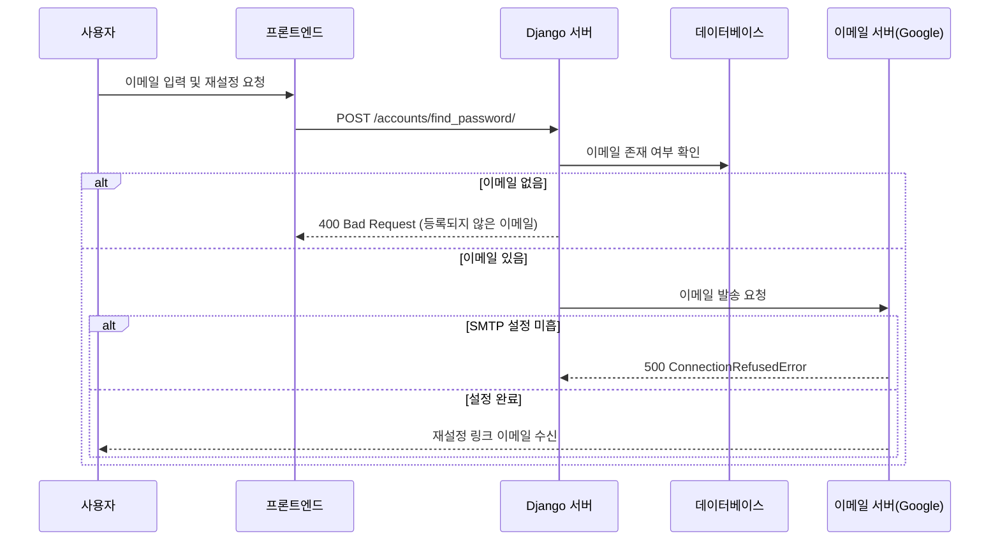

# 비밀번호 재설정 이메일 발송 트러블슈팅

사용자가 비밀번호를 잊어버렸을 때 이메일로 재설정 링크를 보내주는 기능을 구현하면서 겪은 여러 에러와 해결 과정에 대한 기록이다. 

## 구현 흐름 (Flow)

비밀번호 재설정 요청은 다음과 같은 흐름으로 동작한다.



## 트러블슈팅 로그 (Troubleshooting Log)

### 이슈 1: 404 Not Found (URL 라우팅)


*404 Not Found*

- **문제 상황:** `accounts/views.py`에 로직을 다 짰는데, 포스트맨으로 요청을 보내니 404 에러가 발생함.

- **원인:** 앱 내부의 `urls.py`에는 경로를 설정했지만, 프로젝트 전체의 메인 `urls.py`에 해당 앱의 URL을 등록(include)하지 않음.

- **해결:** `dj_rest_auth`의 기본 URL과 커스텀 URL을 모두 등록하여 해결.

```python
# project/urls.py
urlpatterns = [
    # ...
    path('accounts/', include('dj_rest_auth.urls')),  # dj-rest-auth 기본 경로
    path('accounts/', include('accounts.urls')),      # 커스텀 경로 추가
    # ...
]
```

### 이슈 2: Serializer Import Error

- **문제 상황:** 서버 실행 중 `ImportError: cannot import name...` 발생.

- **원인:** 단순 오타. `serializers.py`에서는 `PasswordResetSerializer`로 정의하고, 뷰에서는 `PasswordResetRequestSerializer`로 불러오려 했음.

- **해결:** 클래스명을 올바르게 수정하여 일치시킴.


### 이슈 3. 400 Bad Request


*"등록되지 않은 이메일입니다."*

- **문제 상황:** "등록되지 않은 이메일입니다."
- **원인:** user DB에 저장되어 있지 않은 이메일을 요청함.
- **해결:** 내 실제 이메일로 새로 회원가입을 한 뒤, 다시 요청을 보내어 해결.


### 이슈 4. 500 Internal Server Error (ConnectionRefusedError)

- **문제 상황:** 로직상 문제는 없는데 이메일 발송 단계에서 서버가 500 에러를 반환함.

- **에러 로그:**

    ```
    ConnectionRefusedError: [WinError 10061] 대상 컴퓨터에서 연결을 거부했으므로 연결하지 못했습니다
    ```

- **원인:** Django는 기본적으로 이메일을 보내려 할 때 SMTP 서버(메일 보내는 서버)와 연결을 시도한다. 하지만 로컬 개발 환경(settings.py)에 SMTP 설정이 전혀 되어 있지 않아 연결이 거부된 것.

- **해결:** 개발용 콘솔 백엔드 사용. 실제로 메일을 보내지 않고, 터미널(콘솔)에 메일 내용을 출력하는 방법을 사용하여 디버깅한다. 터미널에 비밀번호 재설정 링크가 정상적으로 출력되는 것을 확인함.

    ```python
    # settings.py
    # 이메일을 보내는 대신 콘솔창에 print를 찍듯이 출력해줌
    EMAIL_BACKEND = "django.core.mail.backends.console.EmailBackend"
    ```


*콘솔 백엔드 출력*

### 실제 이메일로 발송하려면? Google SMTP

실제 배포 환경을 대비해 Google Gmail 서버를 연동하여 테스트했다.

1. 구글 계정 관리 > 보안 > **앱 비밀번호** 발급

2. `.env` 파일에 계정과 앱 비밀번호 저장

3. `settings.py`에 SMTP 설정 추가
    - 이때 입력한 구글 계정이 곧 이메일 발신 계정이 된다.

```python
# .env 파일
EMAIL_HOST_USER=내구글아이디@gmail.com
EMAIL_HOST_PASSWORD=발급받은16자리앱비밀번호(띄어쓰기없이)
```

```python
# settings.py

# 디버깅할 때 서버 터미널에 출력하기 위한 설정
# EMAIL_BACKEND = "django.core.mail.backends.console.EmailBackend"

# 실제 메일 전송을 위한 SMTP 설정
EMAIL_BACKEND = 'django.core.mail.backends.smtp.EmailBackend'
EMAIL_HOST = 'smtp.gmail.com'           # Email을 전송(호스트)하는 서버
EMAIL_PORT = 587                        # Gamil과 통신하는 포트
EMAIL_USE_TLS = True                    # TLS 보안 연결 사용
EMAIL_HOST_USER = os.getenv('EMAIL_HOST_USER')          # 발신할 이메일
EMAIL_HOST_PASSWORD = os.getenv('EMAIL_HOST_PASSWORD')  # 발신할 메일의 비밀번호
DEFAULT_FROM_EMAIL = EMAIL_HOST_USER    # 보내는 사람 이메일
```


*이메일 수신 확인*

- 비밀번호 재설정 링크를 누르면, 해당 페이지로 연결됨. 아직 프론트에 비밀번호 재설정 페이지를 만들지 않아서 빈 화면이지만, 작동하는 것을 확인함.


*비밀번호 재설정 링크 연결*

---

### 레퍼런스

[django SMTP gmail 설정 및 테스트](https://integer-ji.tistory.com/274?category=745989)